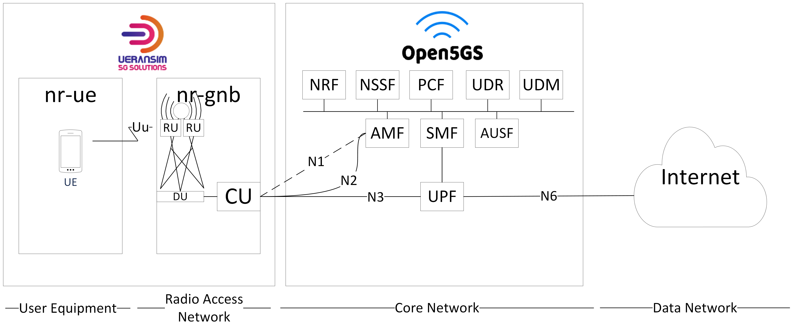
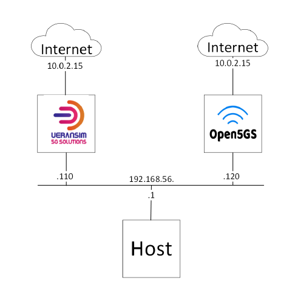
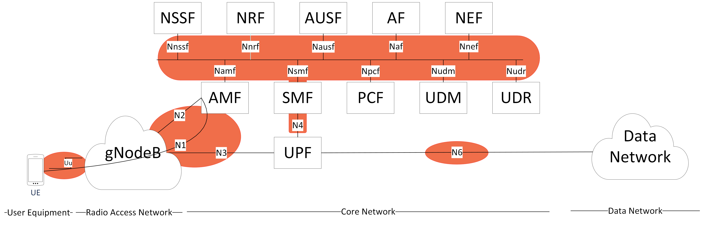
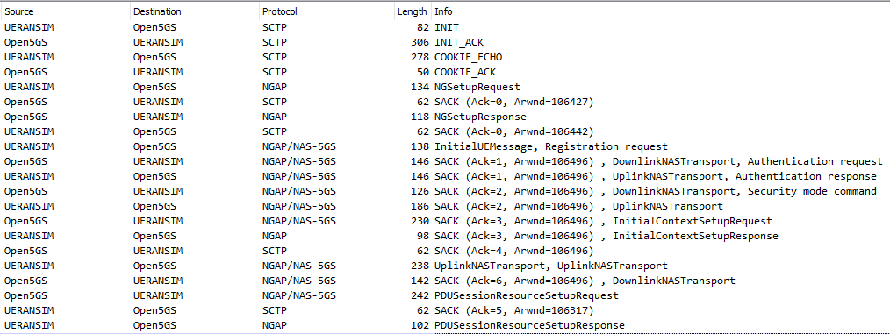

# Obrona - prezentacja

## 1 - Slajd tytułowy

```Projekt i wdrożenie edukacyjnej platformy 5G```

## 2 - Agenda

```
1. Cel pracy
2. Wybór komponentów platformy
3. Platforma 5G
4. Środowisko wdrożeniowe
5. Sygnalizacja - co można monitorować
6. Sygnalizacja -  monitorowanie
7. Podsumowanie
```

## 3 - Cel pracy

``` 
Celem projekt było stworzenie platformy 5G do celów edukacyjnych.

Wymagania:

- oparta o projekty otwarto-źródłowe
- możliwa do wdrożenia na sprzęcie ogólnego przeznaczenia
- umożliwiająca monitorowania sygnalizacji 5G
- łatwa do konfiguracji/zarządzania
```

// tutaj daj ikonki jako myślniki

## 4 - Wybór komponentów platformy

```
Wybór komponentów:
Na podstawie wymagań dokonanu przeglądu, analizy oraz testów istniejących rozwiązań.
Jako część radiową wyrano symulator UERANSIM. Jeśli chodzi o część rdzeniową pierwotnym wyborem był free5gc, jednakże z powodu napotkanych trudności zdecydowano się na Open5GS.

Badanie możliwości:
Cały projekt miał naturę eksloracyjną. Po zbadaniu jak platformę można zbudować, należało przeanalizować, co za pomocą wybranych komponentów można osiągnąć (zasymulować). Szukano funkcjonalnej części wspólnej obu komponentów oraz badano możliwości ich rozbudowy. Z tego powodu końcowy zakres pracy przez długi czas nie był znany i był modyfikowany w oparciu o wyniki tejże eksloracji.

Dopasowanie do wymagań:
Z racji wymagań, należało w pewnym stopniu dopasować do nich komponenty. Przykładem może być tutaj rozwiązanie problemu dodawania subskrybenta do sieci bez GUI (Graphic User Interface), które standardowo odbywa się za pomocą konsoli web osiągalnej jedynie z jej hosta.
```

// tutaj daj to takie rozdzielenie na 3 fajne

## 5 - Platforma 5G



## 6 - Środowisko wdrożeniowe



+dodać na rysunek info, ze to maszyny wirtualne jakie są adaptery, że host ma komunikacje SSH, ze to ubuntu servery itp

+ daj ikonke Oracle VM Vritual Box
+ daj ikonke Ubuntu Server
+ Adaptery sieciowe:
  + Host-only network
  + NAT (Network Address Translation)


## 7 - Sygnalizacja - co można monitorować



## 8- Sygnalizacja - monitorowanie

tcpdump służy do przechwycenia pakietów (stworzono odpowiednie skrypty)

Wireshark jest narzędziem do analizy plików stworzonych przez tcpdump.

"skomentować to jako jednocześnie element testowania całej instalacji"

//daj ikonki tcpdump i wireshark

## 9 - sygnalizacja - zrzuty ekranu

slajd bez tytułu

tylko te dwa screeny



## 9 - Podsumowanie

```
Kroki poczynione na rzecz projektu:
- Wybór i analiza komponentów platformy (UERANSIM i Open5GS)
- Wdrożenie platformy na środowisku opartym o maszyny wirtualne
- Opracowanie sposobu monitorowania sygnalizacji
- Opracowanie instrukcji użytkownika instalacji platformy i jej użytkowania na potrzeby monitorowania sygnalizacji


Możliwości dalszego rozwoju platformy:
- Adaptacja platformy na inne środowiska wdrożeniowe (np. OpenStack)
- Zamiana UERANSIM na urządzenia SDR lub komercyjne femtocelle
- Konteneryzacja funkcji sieciowych Open5GS i wdrożenie sieci rdzeniowej w klastrze Kubernetes
```

tu też daj ikonki zamiast myślników // w drugim wypunktowaniu

